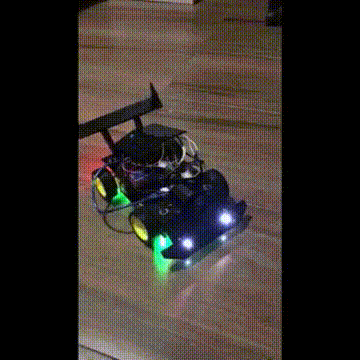

# About-me 🤓

👋 Hello, my name is Wendell Bitencourt. 
 
 
Software Engineer with a degree in Computer Science. I've been professionally active in the tech industry since 2019.

I thrive on technological challenges as they provide the freedom to create and innovate.

I deeply believe in this quote for what it represents in the daily struggles of a developer:

"Do your best with what you have, until you can do better with better means!" - Mario Sergio Cortella
  
 
**📫 How to reach me:**
 
 

 
 
 

**Main languages and tools:**

    <h6>Main</h6>
    
    
    
    
    

 
 

    
    
    
    
    

 
 

    
    
     
    
    

 
 

    

 
 

    <h6>I have experience</h6>
    
    
    
    
    

 
 

    <h6>I am studying</h6>
    

 
 

    <h6>I am interested</h6>
    
    
    
    

 
 
 
 

    

 
<h1 align="center">Projects</h1>

<table bordercolor="#66b2b2" align="center">
    <tr>
        <td width="50%" valign="top" align="center">           
            <h3 align="center">Remote control: Bluetooth car solar powered</h3>
                        
            
            <a align="center" valign="center" target="_blank" href="https://github.com/WBitencourt/Personal-Project/tree/main/RC%20Bluetooth%20car%20solar%20powered">
                 
                
                Click here to see repository
            </a>    
        </td>    
        <td width="50%" valign="top" align="center">           
            <h3 align="center">DYMOVIE</h3>
                        
            
            <a align="center" valign="center" target="_blank" href="https://github.com/WBitencourt/Personal-Project/tree/main/dymovie">
                 
                
                Click here to see repository
            </a>    
        </td>  
    </tr>
</table>
