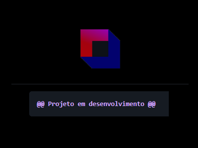

# About-me 🤓

👋 Hello, my name is Wendell Bitencourt. 
 
 
I have objective of doing a great job as a Software Engineer.

I am helpful and creative, understanding that quality and deadlines are important. I have been developing personal projects since I was 15 years old and hold a degree in computer science, contributing with my four years of professional experience in the development field.

"Do your best in the condition you are, while you don't have better conditions, to do even better!" - Mario Sergio Cortella.
  
 
**📫 How to reach me:**
 
 

 
 
 

**Main languages and tools:**

    <h6>I have experience</h6>
    
    
    
    
    
    
    
    
    
    
    
    
    
    

 
 

    <h6>I am studying</h6>
    
    
    
    
    
    

 
 

    <h6>I am interested</h6>
    
    
    

 
 
 
 

    <!--!-->
    <!--!-->

 
<h1 align="center">Projects</h1>

<table bordercolor="#66b2b2" align="center">
    <tr>
        <td width="50%" valign="top" align="center">           
            <h3 align="center">Remote control: Bluetooth car solar powered</h3>
                        
            
            <a align="center" valign="center" target="_blank" href="https://github.com/WBitencourt/Personal-Project/tree/main/RC%20Bluetooth%20car%20solar%20powered">
                
                Click here to see repository
            </a>    
        </td>    
        <td width="50%" valign="top" align="center">           
            <h3 align="center">Event NLW Edition 08 - RocketSeat 🚀</h3>
                        
            
            <a align="center" valign="center" target="_blank" href="https://github.com/WBitencourt/Technology-course/tree/master/NLW">
                
                Click here to see repository
            </a> 
        </td>  
    </tr>
    <tr>
        <td width="50%" valign="top" align="center">           
            <h3 align="center">DYMOVIE</h3>
                        
            
            <a align="center" valign="center" target="_blank" href="https://github.com/WBitencourt/Personal-Project/tree/main/dymovie">
                
                Click here to see repository
            </a>    
        </td>    
    </tr>
</table>
